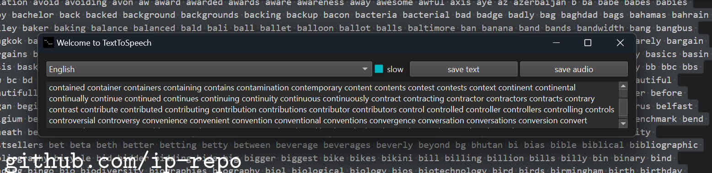

</omg>

# Example: text to speech widgets with gtts and PySide6

<details><summary>Before we start</summary>

First we need to install to python libraries: PySide6 and gtts.
```
#python 3.12
git clone https://github.com/ip-repo/guides.git
cd example-tts-pyside6
python -m venv ttsv
ttsv\Scripts\activate
pip install PySide6 #6.6.2
pip install gtts #2.5.1
```

</details>

<details><summary>Quick gtts overview</summary>

Basic usage
```
#convert txt file to audio
gtts-cli "Hello world" --output hello-world.mp3
#convert txt file to slower audio
gtts-cli "Slow speech" --slow --output hello-world.mp3
gtts-cli -f text.txt --output text-as-speech.mp3
#convert txt file to audio with other supported language
gtts-cli -f text.txt -l fr --output french-speech.mp3 
#convert to other supported language
gtts-cli "Bonjour mounde" -l fr --output french.mp3
#list supported languages
gtts-cli --all
#help
gtts-cli --help
```
String to speech 
```python
from gtts import gTTS
mytext = "Bonjour monde"
language = "fr"
myobj = gTTS(text=mytext, lang=language, slow=False)
myobj.save("french.mp3")

```
Text file to speech mp3
```python
from gtts import gTTS
with open("textfile.txt", "r") as f:
    mytext = f.read()
language = "vi"
myobj = gTTS(text=mytext, lang=language, slow=False)
myobj.save("vietnamese.mp3")

```
</details>
<details><summary>Example 1: PySide6 and gtts</summary>
Lets start by importing the necessary objects and creating a class for our widget.

```python
import gtts
import gtts.lang
from PySide6.QtTextToSpeech import QTextToSpeech
from PySide6.QtWidgets import (QApplication,QStyleFactory, QWidget,QFileDialog, QHBoxLayout,QVBoxLayout, 
								QTextEdit, QPushButton, QComboBox,QCheckBox)
from PySide6.QtGui import QIcon
import time
import subprocess

class TextToSpeechWidget(QWidget):
	def __init__(self, *args, **kargs) -> None:
		super().__init__(*args, **kargs)
        self.init_objects()
		self.init_ui()
		self.init_signals()

```
Next we will create a method to init the ui.

```python
    def init_ui(self):
        self.setWindowTitle("Welcome to TextToSpeech")
        self.setWindowIcon(QIcon("logo.png"))
		self.setGeometry(0,0, 600,400)
		controls_layout = QHBoxLayout()
		controls_layout.setSpacing(2)
        #select language 
		self.lang_box = QComboBox()
		self.lang_box.addItems(self.reverse_lang_dict.keys())
        #save text
		self.save_text_btn =QPushButton("save text")
        #save speech
		self.save_speech_btn = QPushButton("save audio")
        #set slow speech
		self.slow = QCheckBox("slow")
		controls_layout.addWidget(self.lang_box, 3)
		controls_layout.addWidget(self.slow,1//4)
		controls_layout.addWidget(self.save_text_btn, 1)
		controls_layout.addWidget(self.save_speech_btn, 1)
		main_layout = QVBoxLayout()
        #text container
		self.text_edit = QTextEdit()
		main_layout.addLayout(controls_layout,1)
		main_layout.addWidget(self.text_edit, 10)
		self.setLayout(main_layout)

```
Now can create a text object or a language dictionary
```python
    def init_objects(self):
        #this number is the maximum characters that will be processed from text edit widget
		self.text_max_len = 5000
        #languages dictionary for combo box and gtts
		self.lang_dict = gtts.lang.tts_langs()
		self.reverse_lang_dict = {}
		for key in self.lang_dict.keys():
			self.reverse_lang_dict[self.lang_dict[key]] = key
        #file handler
		self.file_dialog = QFileDialog()
```
We have created qt object that has signals and this will help us react to user input.
```python
    def init_signals(self):
        #save speech clicked
		self.save_speech_btn.clicked.connect(self.save_speech_btn_clicked)
        #save text clicked
		self.save_text_btn.clicked.connect(self.save_txt_btn_clicked)
```
The signlas are linked to methods that get executed when buttons are clicked.
```python
    def save_speech_btn_clicked(self):
        #get the text in the text container
		text = self.text_edit.toPlainText()
		if text:
            #disable widget
			self.setDisabled(True)
			self.setWindowTitle("Working on it....")
            #test if user want a slow speech
			if self.slow.checkState().value == 2:
				slow = True
			else:
				slow = False
            #find out which language to use 
			lang = self.reverse_lang_dict[self.lang_box.currentText()]
            #prepare saving path
			file_name, _ = self.file_dialog.getSaveFileName(None,"Save speech as audio",
            "output.mp3","MP3 (*.mp3);;WAV (*.wav);;")
			if file_name:
                #time to creation time
				t1_start = time.perf_counter()
                #create audio file with gtts-cli
				if slow:
					subprocess.run(["gtts-cli", text[:self.text_max_len],"--slow", "--output", file_name, "-l", lang])
				else:
					subprocess.run(["gtts-cli", text[:self.text_max_len],"--output", file_name, "-l", lang])
                #end time
				t1_stop = time.perf_counter()
				print("exection time:",t1_stop - t1_start, "seconds")
            #enable widget
			self.setEnabled(True)	
		else:
			self.setWindowTitle("Can't convert nothing....")
	
	def save_txt_btn_clicked(self):
        #disable widget
		self.setDisabled(True)
        #prepare text and cut up to the maximum length
		text = self.text_edit.toPlainText()[:self.text_max_len]
        #prepare saving path
		filename,_ = self.file_dialog.getSaveFileName(None,"Save as text file","output.txt",
        "Text Files (*.txt)")
		if filename:
            #save text file
			with open(filename, "w") as f:
				f.write(text)
            #enable widget
			self.setEnabled(True)	


```
And now we can create out widget and launch it.
```python 
if __name__ == "__main__":
    #create application instance
	app = QApplication()
    #set application style
	app.setStyle(QStyleFactory.keys()[2])
	app_widget = TextToSpeechWidget()
	#maximum characters length to process to speech 
	app_widget.text_max_len = 10000
	app_widget.show()
	app.exec()
```
If you have created a venv and installed the required libraries you can now Run the file **widget_one_run.py**
```python
(ttsv)python widget_one_run.py
```
This will work well depending on your hardware and can take a long time to process try remaining around 5000 characters.
While the speech is being processed the widget is unavailable.
It might seem surprising but 10000 characters can turn into a audio file of 15 mins.
</details>
