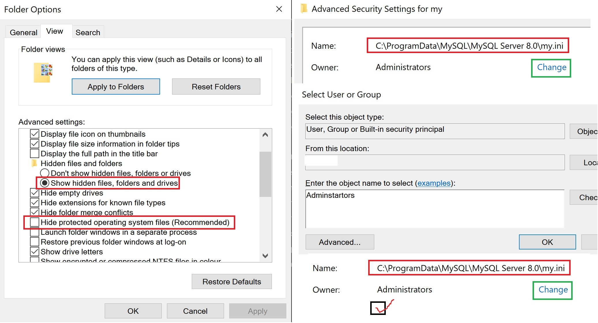
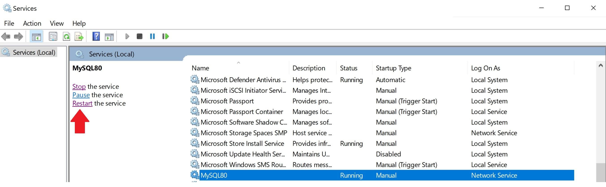
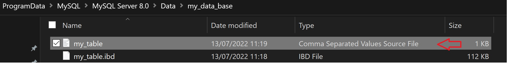

## How to export a table from local MySQL server into a csv/text file? (On Windows 10) 
So you have a running MySQL server and you might even created a database that has tables but now you want to export the data ...

To achive our goal follow this steps:
* First open MySQL Cli and access the server then create database and add a table.
* Find the server my.ini file
* Add a option that allow I/O operation to my.ini
* Restart MySQL service.
* Locate the created file in the database folder inside server data folder.

Lets create a database named my_data_base and use it.
```sql
CREATE DATABASE my_data_base;
Use my_data_base;
```
Its time to create a table named my_table and add some values to it.
```sql
CREATE TABLE my_table(unique_id INT NOT NULL AUTO_INCREMENT, some_data VARCHAR(40) , PRIMARY KEY(unique_id));
INSERT INTO my_table(some_data) VALUES('Amazing');
INSERT INTO my_table(some_data) VALUES('Wow');
INSERT INTO my_table(some_data) VALUES('Excellent');
```
Now lets be naive and try to write the table to a csv file.
```sql
SELECT * INTO OUTFILE 'my_csv.csv' FROM my_table;
```
The error that we get means that server isn't allowd to preform I/O operation so we need to bypass that and to do that we will need to update a deticated file.
```sql
ERROR [error_number] (HY000): The MySQL server is running with the --secure-file-priv option so it cannot execute this statement
```
The .ini files contains configuration information about user's preferences and operating environmet.
The file that we need to alter can be found mostly in C:\ProgramData\MySQL\MySQL Server [version]\my.ini.
So one can change the file manualy like any text file, just open it and add the two lines below.

Note: access can be denied so make sure that user has permmisions to do that operation.

</img>

```sql
#add to my.ini 
[mysqld]
secure_file_priv = ""
```
The method above will work but lets create a PowerShell script to automate this task.
Create a text file and add the following commands and make sure to save as .ps1 file.
```powershell
Write-Host Updating --secure-file-priv option...
cd "C:\ProgramData\MySQL\MySQL Server 8.0\"
Add-Content my.ini ''
Add-Content my.ini '[mysqld]'
Add-Content my.ini 'secure_file_priv = ""'
Add-Content my.ini ''
Write-Host Done.
Write-Host Remmber to revert this option when done ~_^
Write-Host I/O Allowd.
```
I have named the script my_script.ps1 Open PowerShell as adminstrator and type the following command to allow execcuting scripts and then run the file
```powershell
Set-ExecutionPolicy RemoteSigned 
#type YES
& C:\PATH\TO\my_script.ps1

```
We need to restart the MySQL[version] service
</img>
Now everything is set and its time to export our table as  csv file.
```sql
SELECT * INTO OUTFILE 'my_table.csv' FIELDS TERMINATED BY ','OPTIONALLY ENCLOSED BY '"' LINES TERMINATED BY '\n' FROM table;
```
Now our file is created, but where is it?
MySQL server dont create the file by default on the local machine it will be created on the server data file and can be found inside the specific database folder
</img>
Dont forget to disable scripts on power PowerShell
```powerhsell
Set-ExecutionPolicy Restricted
```
