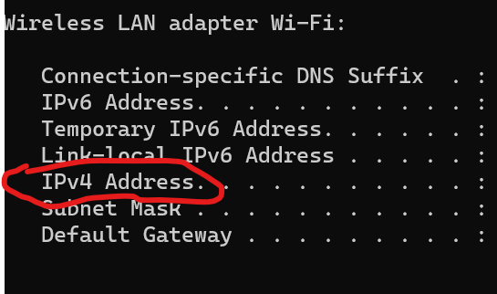

# socket programming: shutdown windows pc from android phone

The idea is simple.

We have a windows pc that is running a server-side python script and waiting for a connection from client.<br>
The client can be any other machine that can connect to the same network as the pc.<br>
In this example we will use an **android phone that has termux and python installed** as the client-side.<br>
When the phone user (the client) run the client-side python script he can choose a command that will be executed on pc.<br>
The commands available are using the **shutdown.exe** tool that usally come with windows os.<br>

This program allow the client to use the following commands:
* shutdown now - shutdown /s /t 0
* restart now - shutdown /r /t 0
* log off - shutdown /l
* exit the program without command.

**Note**: this example assume that you have termux on your android phone so if you dont have you can <a href="https://www.geeksforgeeks.org/how-to-install-termux-on-android/">follow this instructions</a>.<br>
Make sure to install python on termux.
```
pkg install python
```
**Note**: if you are not able install python then change the termux repo by using **termux-change-repo**
and then try again.

**server-side**: run the script on a pc with windows and the server will wait for a client connection and then for a command.

```python
import socket
from os import system

def execute_command(user_command : str) ->None:
	"""
	this function get a command and execute it using the os module.
	"""
	system(command=user_command)
	
if __name__ == "__main__":
	commands = {1 : "shutdown /s /t 0", 2: "shutdown /r /t 0", 3: "shutdown /l", 4 : None}
	HOST = socket.gethostname() # or 0.0.0.0
	PORT = 8821
    #server socket object
	with socket.socket(socket.AF_INET, socket.SOCK_STREAM) as server_socket:
		server_socket.bind((HOST, PORT))
		server_socket.listen()
		client_connection, client_address = server_socket.accept()
		with client_connection:
			print("A client is now connected to the server.")
			print("Waiting to receive command.")
			client_command = client_connection.recv(1).decode()
			print("Got the command number:",client_command)
		print("Client connection closed.")
		
	if commands[int(client_command)]:
		execute_command(user_command=commands[int(client_command)])
	else:
		print("server is down, no command was excuted on pc.")

```
Before running the client side on the android phone we will need to know the ip address and port to connect to.<br>
Open a command prompt and type:
```Console
ipconfig
```
</img>

Type your pc Ipv4 address in the client-side python script under HOST.

**Note**: you might need to disable windows firewall for this script to work.

**client-side**: run from another machine on the same network.

```python
import socket

def show_commands_menu() ->None:
	"""
	this fucntion just print the client the options he can pick from.
	"""
	commands = {1 : "shutdown", 2 : "restart", 3 : "log off", 4 : "exit without command"}
	for key in commands.keys():
		print(key, ":", commands[key])

HOST =  # YOUR PC(SERVER-SIDE SCRIPT) IPV4 ADDRESS!
PORT = 8821
#client socket object
with socket.socket(socket.AF_INET, socket.SOCK_STREAM) as client_socket:
	client_socket.connect((HOST, PORT))
    print("connection with server is up")
	show_commands_menu()
	user_input = input().rstrip()
	while user_input not in ["1","2","3","4"]:
		user_input = input().rstrip()
	client_socket.send(user_input.encode())
```